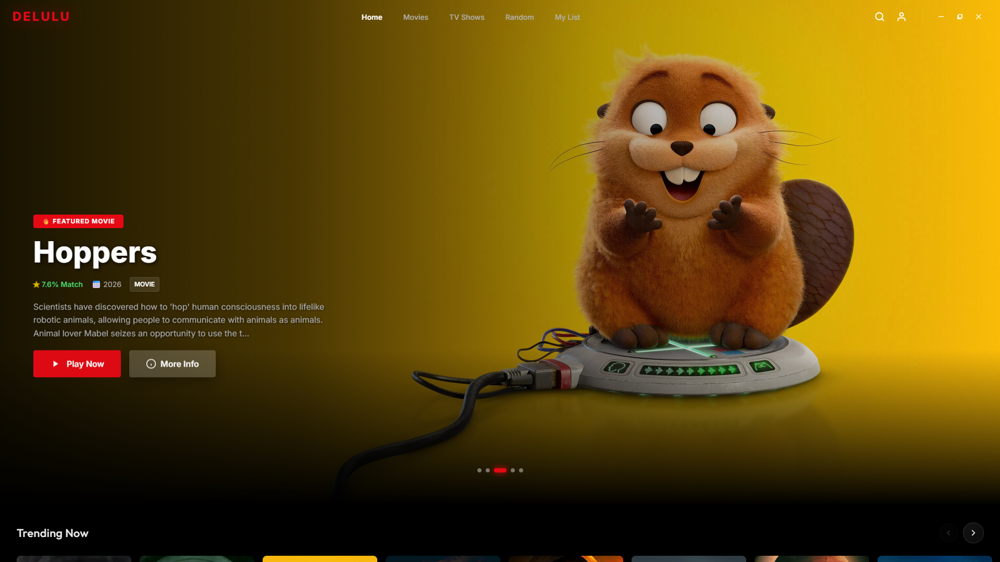
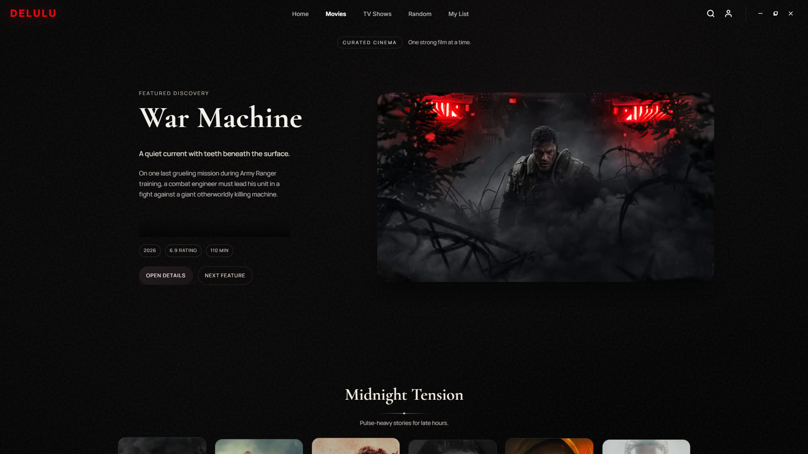
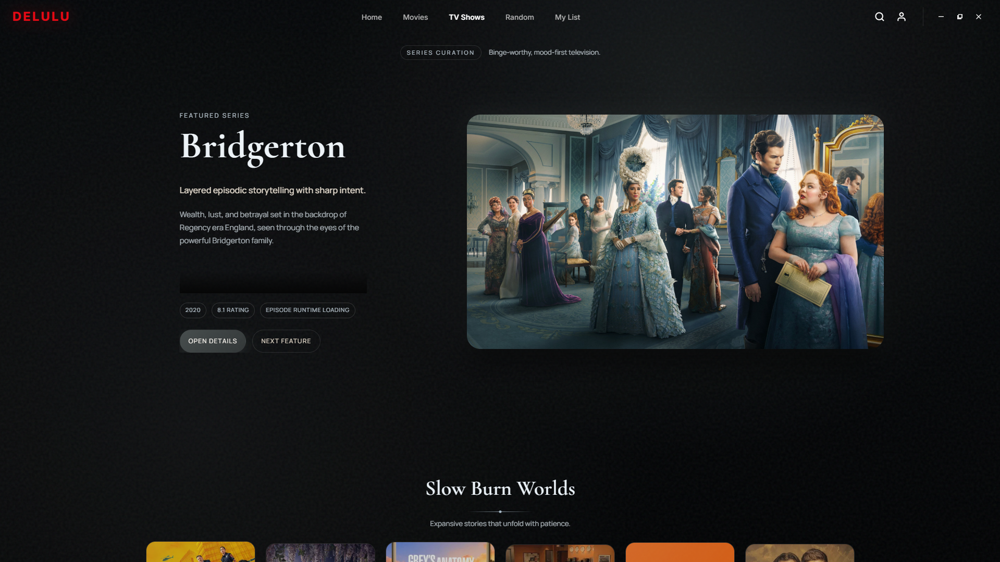
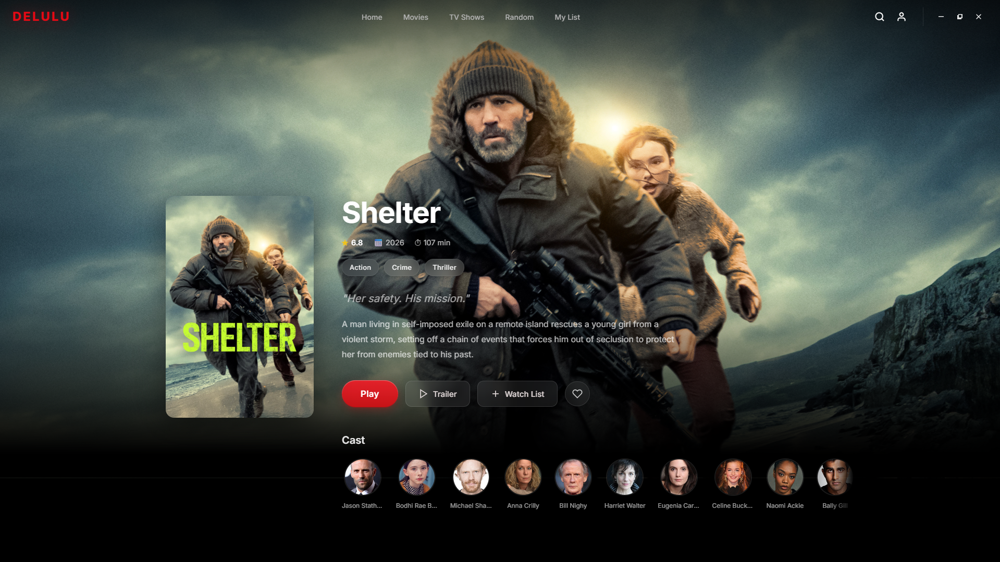
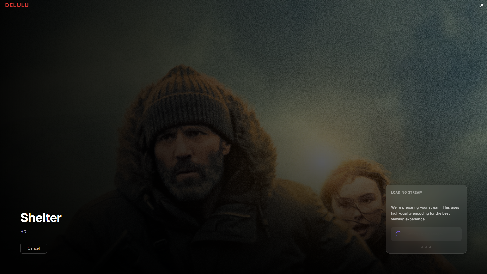
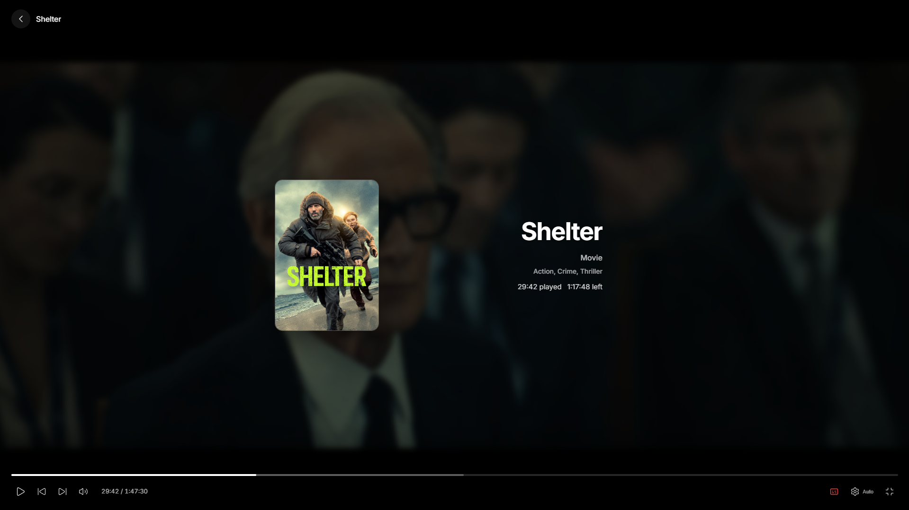
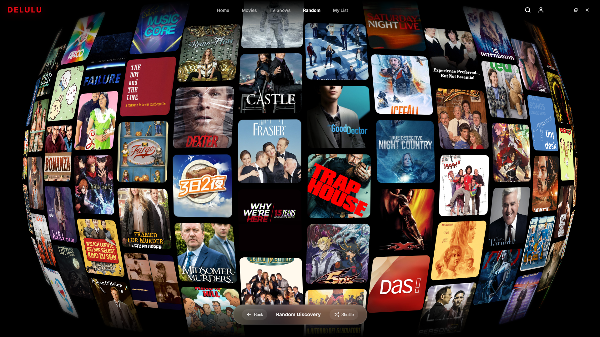
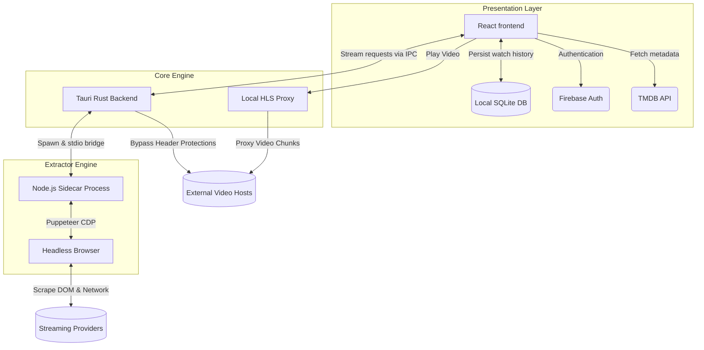

# Delulu

A hybrid local-first desktop media application built with Tauri, React, and a headless Chromium extraction engine.

## Overview

Delulu is a performance-focused desktop application designed to scrape, extract, and stream media content (Movies and TV Shows) directly on the client machine. The core philosophy of the application is to bypass unreliable third-party streaming APIs by securely orchestrating a hidden headless browser locally on the user's PC. This ensures that the application resolves stream URLs dynamically and seamlessly handles HLS proxying and local caching without depending on an external centralized server for media extraction.

## Screenshots

<p align="center">
  
</p>

<p align="center">
  
  
</p>

<p align="center">
  
</p>

<p align="center">
  
  
</p>

<p align="center">
  
</p>

<p align="center">
  
  
</p>

## Key Features

- **Local-First Stream Extraction:** Utilizes a Node.js/Puppeteer sidecar managed by Rust to securely launch a headless Chromium instance, scrape streaming providers (like VidLink), and pipe the extracted `.m3u8` playlists and subtitles back to the frontend.
- **Embedded HLS Proxy:** A built-in Rust HTTP proxy that overrides headers (like `Referer` and `Origin`) on-the-fly to bypass hotlinking protections from streaming hosts.
- **Offline-Capable User Data:** User preferences, watch history, and progress tracking are stored locally in an embedded SQLite database using Tauri's SQL plugin.
- **Client-Side Authentication:** Direct integration with Firebase Authentication for user sign-in and account management.
- **Long-Lived Local Cache:** Extracted streaming URLs are cached persistently in the frontend's `localStorage` to provide instant playback on revisit.
- **Dynamic Browser Discovery:** The Rust sidecar implements fallback chains (Windows Registry parsing, PATH checking) to automatically detect installed browsers (Edge, Chrome, Brave, WebView2) for the headless extraction process.
- **Chromeless UI:** A seamless, borderless Tauri window design implemented via React and smooth-scrolling with Lenis.

## Architecture

Delulu is a three-tier hybrid desktop architecture containing the presentation layer (React), the systems bridge (Rust), and the headless extraction engine (Node.js).

### Component Breakdown

1. **Frontend (`tauri.deluluapp/src`)**
   - **Framework:** React 19.1 + Vite 7 + TypeScript
   - **Responsibilities:** Renders the user interface, manages application state, orchestrates client-side routing, stores watch history locally (SQLite), coordinates authentication (Firebase), and caches extracted links locally.
   - **Key Modules:** `tmdb.ts` (metadata), `database.ts` (SQLite history), `vidlink.ts` (streaming frontend APIs).

2. **Core Engine Bridge (`tauri.deluluapp/src-tauri/src`)**
   - **Framework:** Tauri v2 Core (Rust) 
   - **Responsibilities:** Manages the system-level window state, proxies HLS streams, natively spawns and lifecycle-manages the Node.js sidecar process, and securely delegates streaming extraction requests from the frontend to the sidecar via standard I/O streams.
   - **Key Modules:** `lib.rs` (Sidecar lifecycle and window creation), `proxy.rs` (HTTP request interceptor for spoofing Referer/Origin headers).

3. **Local Extractor Sidecar ([hls-extractor-local](https://github.com/ZacKXSnydeR/hls-extractor-local.git))**
   - **Framework:** Node.js + Puppeteer Core
   - **Responsibilities:** Bootstraps a headless browser based on the Rust engine's request, dynamically searches the DOM for specific media elements and network requests, bypasses captchas/bot detection locally, and returns the raw stream assets (`.m3u8` and `.vtt`).
   - **Key Modules:** `stdio-bridge.js` (JSON I/O boundary), `extractor.js` (Puppeteer orchestration logic).

### System Boundaries



### Data Flow for Video Playback

1. **Request:** The user clicks a movie in the React UI.
2. **Metadata:** `tmdb.ts` fetches the metadata (title, poster, ID).
3. **Cache Check:** `streamCache.ts` checks `localStorage` for a previously extracted `.m3u8` link for this movie.
4. **Extraction (On Cache Miss):** 
   - React calls `invoke('extract_provider_stream')`.
   - The Rust engine (`lib.rs`) pipes a JSON payload to `stdio-bridge.js`.
   - Node uses Puppeteer to stealthily load the provider, extract the stream, and pass the URL back to Rust, then React.
5. **Playback:** React begins playing the `.m3u8` URL. If providers block direct `<video>` loading, traffic operates through `proxy.rs` running on `localhost:PORT`.

## Configuration & Environment Variables

The application relies on multiple environment `.env` files for build-time configuration. Key environment variables dictate TMDB access and Firebase integration limits.

### Frontend (`tauri.deluluapp/.env`)
- `VITE_TMDB_API_KEY`: API key for fetching media metadata.
- `VITE_FIREBASE_API_KEY`: Firebase authentication key.
- `VITE_FIREBASE_AUTH_DOMAIN`: Firebase auth domain.
- `VITE_FIREBASE_PROJECT_ID`: Firebase project identifier.
- `VITE_FIREBASE_STORAGE_BUCKET`: Firebase storage reference.
- `VITE_FIREBASE_MESSAGING_SENDER_ID`: Firebase messaging setup.
- `VITE_FIREBASE_APP_ID`: Firebase application identifier.
- `VITE_FIREBASE_MEASUREMENT_ID`: Google Analytics tracking limits.

## Build Process

The project employs two distinct build flows depending on execution context.

To run the application in development mode with HMR:
```bash
cd tauri.deluluapp
npm install

# Installs and bundles the sidecar dependencies, tests the stdio-bridge, and launches Tauri
npm run tauri dev
```

To create a release build (e.g., `.exe` or an `nsis` installer):
```bash
cd tauri.deluluapp
npm run tauri build
```
## Getting Started

### Prerequisites
- **Node.js:** v20+
- **Rust:** Latest stable version
- **Chromium Browser:** Edge, Chrome, or Brave (Required for extraction)

### Installation
1. Clone the repository: `git clone https://github.com/ZacKXSnydeR/DeluluDesktop.git`
2. Install dependencies: `cd tauri.deluluapp && npm install`
3. Set up environment: Copy `.env.example` to `.env` and add your TMDB/Firebase keys.
4. Run in dev mode: `npm run tauri dev`

For detailed setup instructions, see [docs/development.md](docs/development.md).

## Usage
1. Open the application.
2. Sign in or create an account via Firebase.
3. Search for a movie or TV show.
4. Click **Play** and wait for the local extraction engine to resolve the stream.
5. Enjoy high-quality streaming with local history tracking.

See [docs/usage.md](docs/usage.md) for more details.

## Contributing
Contributions are what make the open-source community such an amazing place! Any contributions you make are **greatly appreciated**.

Please see [CONTRIBUTING.md](CONTRIBUTING.md) for guidelines.

## License
Distributed under the MIT License. See [LICENSE](LICENSE) for more information.

## Security
For security-related issues, please refer to our [Security Policy](SECURITY.md).
