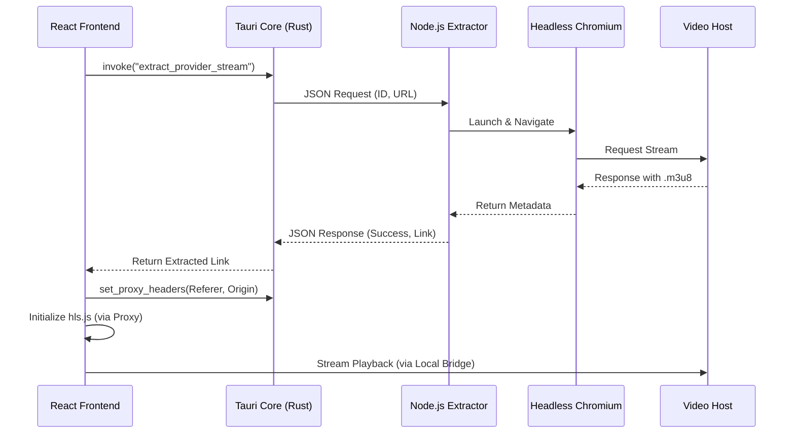

# Architecture Overview

Delulu is a hybrid desktop application (v1.0.0)

## System Components

### 1. Presentation Layer (React)
- **Framework:** React 19 + TypeScript + Vite.
- **Role:** Handles the UI, user interactions, and local state.
- **Data Persistence:** Uses `@tauri-apps/plugin-sql` to interact with a local SQLite database for watch history and settings.
- **API Integration:** Fetched metadata directly from TMDB and interacts with Firebase for Authentication.

### 2. Core Control Bridge (Tauri/Rust)
- **Framework:** Tauri v2 core (Rust).
- **Role:** The "Brain" of the application. It manages window lifecycle, system-level permissions, and security.
- **HLS Proxy:** Implements a custom Rust-based proxy to intercept and modify HTTP headers (Spoofing `Referer`/`Origin`) to bypass stream hotlinking protections.
- **Sidecar Management:** Spawns and communicates with the Node.js extraction engine via a JSON-based stdio bridge.

### 3. Extraction Engine ([hls-extractor-local](https://github.com/ZacKXSnydeR/hls-extractor-local.git))
- **Framework:** Node.js + Puppeteer.
- **Role:** Executes the "heavy lifting" of scraping. It launches a headless browser instance to load streaming providers, navigate the DOM, and extract raw `.m3u8` links and subtitles.
- **Privacy:** Since this runs locally, no session data or identifying IP information is sent to a central server.

## Data Flow Diagram

## Security Model

The security model is based on **Process Isolation**:
- The Frontend has limited access to the system.
- The Rust backend acts as a gateway for sensitive operations (File I/O, Networking, Child Processes).
- The Extraction Engine is completely isolated and only communicates back via a structured JSON bridge.
